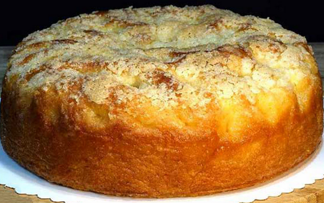

# Apfel Schmand Kuchen

{: .img-center-horizontal}

## Kosten
:fontawesome-solid-dollar-sign:{ .active-money }:fontawesome-solid-dollar-sign:{ .active-money }:fontawesome-solid-dollar-sign:{ .inactive-money }:fontawesome-solid-dollar-sign:{ .inactive-money }:fontawesome-solid-dollar-sign:{ .inactive-money }

## Zutaten
???+ example "Teig"
    - 1pkg Vanillezucker
    - 2 Eier
    - 150g Butter
    - 100g Zucker
    - 300g Mehl
    - 1tl Backpulver
  
???+ example "Guss"
    - 30g Zucker
    - 2 Eier
    - 250g Schmand
  
???+ example "Belag"
    - 3 Äpfel

## Zubereitung
???+ abstract "Schritte"
    - Zuerst den Zucker mit Butter und Vanillezucker schaumig rühren. Die Eier unterrühren und zum Schluss das Mehl mit dem Backpulver untermischen. Den Teig in eine gefettete Springform streichen.
    - Die Äpfel fein schälen, in kleine Stücke schneiden und diese leicht in den Teig drücken. Den Kuchen bei 190° Grad 10 Minuten vorbacken.
    - Aus Zucker, Eiern und Schmand einen Guss rühren und diesen nach den 10 Minuten Vorbackzeit auf den Kuchen geben. Den Kuchen weitere ca. 40 Minuten backen. Sowas von lecker ist er !
    - Mit Puderzucker bestreuen.